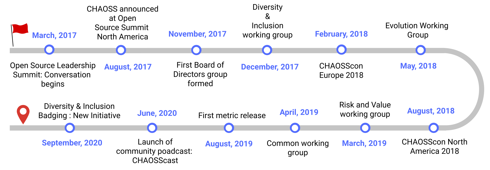

# CHAOSS History


**NOTE**: Click on the below image to see the zoomed version of the CHAOSS History Timeline. \([SVG](https://github.com/chaoss/community-handbook/blob/master/about/CHAOSS_History_Timeline.svg)\)


### Evolution of CHAOSS at Open Source Sumit North America

There was a meeting at the Linux Foundation Leadership Summit which is now known as the member summit. It started from the whiteboard in the room where some groups of people planned to talk about community health. There were many interests from the people and there were folks from the Open Source program Office and different foundations. Concluding through the community health discussions, it leads to the evolution of CHAOSS at Open Source Summit North America 2017

### Bitergia extends its hands to help CHAOSS during their origin

Bitergia was formed in 2012 by a group of folks who were researching around community metric system and health. So Bitergia came forward to support the CHAOSS by providing various insights and metrics including a project\(GrimoireLab\) which they thought about donating or moving under the Linux Foundation. So after making fair research around metrics and the toolsets which could support the vision, it was decided to get these together and build the academics to study this phenomenal and formalize it whereas Bitergia on the other hand has the tools, providing professional services around The Linux Foundation. So all got together to participate in this project and worked several weeks and months on establishing it. Later the Grimoirlab became part of the CHAOSS community.

### Linux Foundation involvement during the CHAOSS evolution

Some folks present at Open Source Summit North America from the Linux Foundation were keen to measure the community health issues and they started with the discussions of needing the metric mechanism, talking with various folks. It was not expected that someone would join the other people to discuss this topic but there were huge interests and folks after collaborating started with the CHAOSS as a Linux Foundation project.

### Formation of Diversity & Inclusion Working Group

Diversity and Inclusion are known to challenge unchecked assumptions
 and lead to more open and fair collaboration practices.
 Since diversity and inclusion are central to the health of open source communities so the CHAOSS Diversity & Inclusion \(D&I\) Working Group was formed, aiming at bringing experiences to measure diversity and inclusion consistently across open source projects, supported by software where possible.

### Formation of Evolution Working Group

An OSS community goes through stages of Evolution. The state that a
 community is in may prove important when evaluating both across and
 within community concerns So evolution working group was formed to focus on the lifecycle of open source projects.

### Formation of Risk Working Group

The Risk working group was formed to focus on metrics for issues pertaining to risk in open source. The Risk metric informs how much risk an OSS community might carry
 or pose.

### Formation of value Working Group

Value group was formed to develop the metrics that, when measured, help make the impact of community work more transparent. Developers and organizations capture value from engaging in OSS
 communities. This set of metrics can inform what this value is. 

### Start of CHAOSScon conference

CHAOSScon evolved from the Grimoirecon which Bitergia had been organizing before it became a part of CHAOSS in 2017, and the time when the Bitergia joined the CHAOSS, there were discussions to have the CHAOSS conference altogether. 1 year later when the Grimoirelab conference was organized it was initially called as CHAOSScon + Grimoirecon after the discussion but later it was just called as CHAOSScon because comunity thought that it was important for the individual projects to have its conference where they could Learn about open source project health metrics and tools used by open source projects, communities, and engineering teams to track and analyze their community work.

