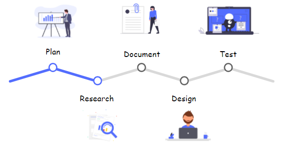

# Design Worklfow

### Our Process

We follow a 4-query procedure to solve the design issues. Each question is a step toward the completion of the product.

* **What do we want?** We need to initiate the requirement goals that define - what are we trying to achieve? How will it impact the CHAOSS community? 
* **What do we have?** We need to take into consideration the information we have - Do we have any set of design guidelines or information for the specific new goal that we are trying to achieve? 
* **How do we get what we want?** We need solid ideation in order to achieve any goal - Does the community agree to follow the new goal? Do we have any plans or processes to achieve the new design goal? 
* **What will happen when we do?** We need to understand the future impact for any specific design goal - Is the problem solved? Is this what you were looking forward to having? Will it create a better impact on the CHAOSS community? 

### Ways of Achieving

\*\*\*\*💡 **Planning** - You should be good to commence your design with planning as design inquires into the nature of a problem to conceive a framework for solving that problem. In general, planning is problem-solving, while the design is putting problems into actions. 

\*\*\*\*🧐 **Research** - Make generative research together with the CHAOSS community members the requirements and assets that are needed. Check what impedes their productivity.

\*\*\*\*✍ **Documentation** - Documentation stands out as one of the most important parts of any implementation design goal. After making fair research you should write down all the requirements you need with the available resources.

\*\*\*\*🖌 **Designing** - High time! Once all the objectives and requirements are defined, draft your thoughts into the canvas that will help in solving the critical design problem that you are trying to achieve.

\*\*\*\*🧪 **Testing** - Testing is the stage in the design process that enables you to evaluate your design problem or service with real users and enables you to create more community-oriented design solutions.

