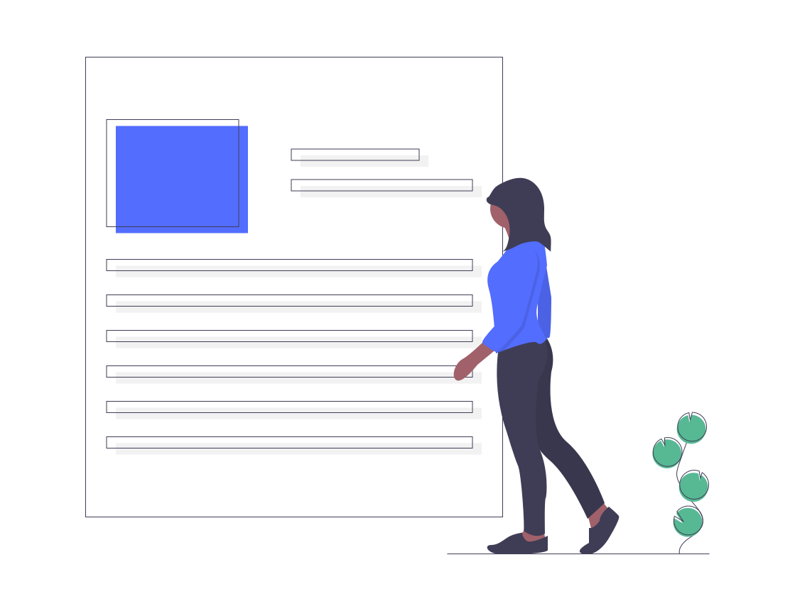
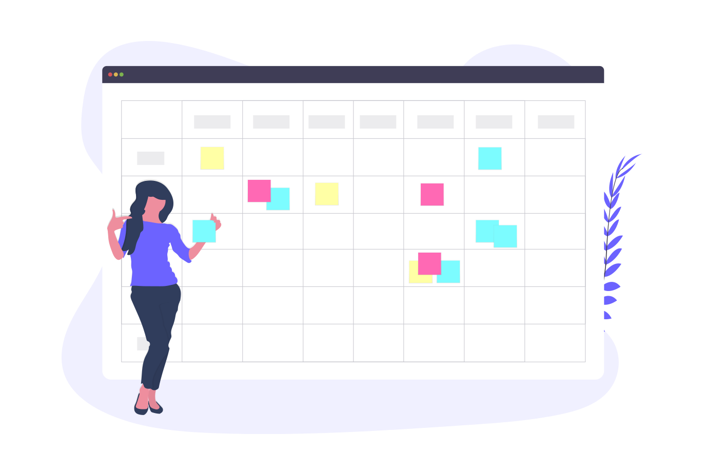
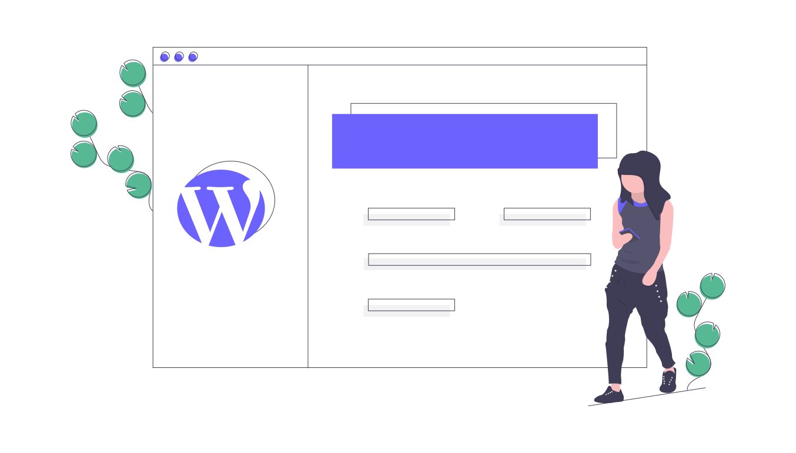
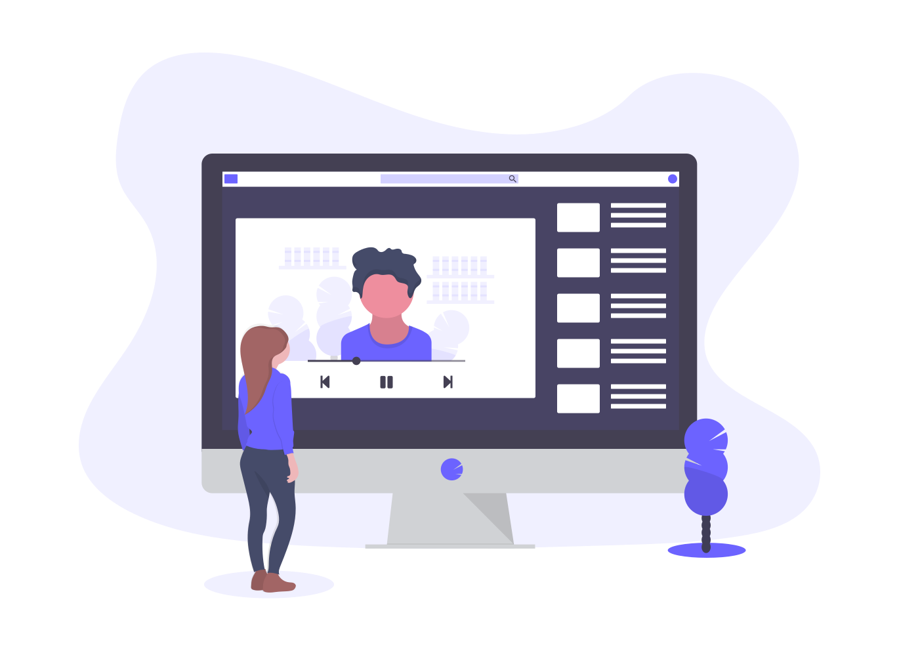
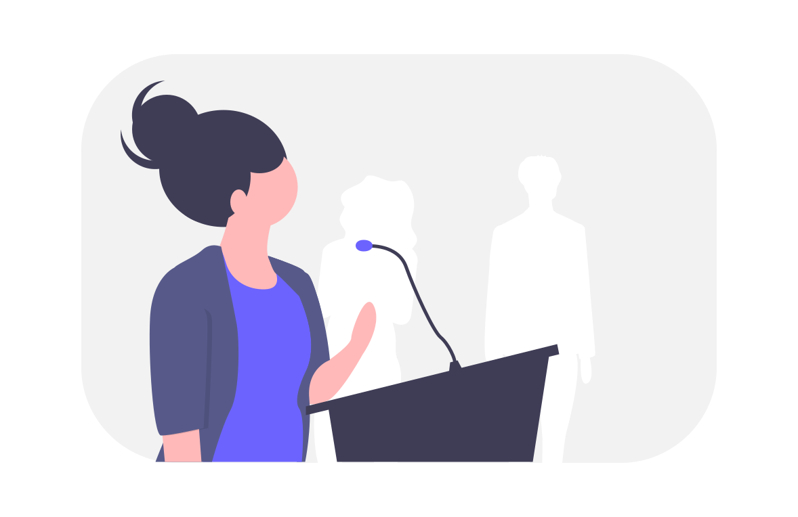

# CHAOSS Specific Terms

### **Open Source Community Health**

The potential that an open-source software community continues developing quality software.

### **Code Review**

It is a software quality assurance activity under the CHAOSS that consciously and systematically convenes with one’s fellow programmers to check each other’s code for mistakes, and shows acceleration and streamlines towards the process of software development by following best practices.

### **Open Source Software Metric**

> Without data, you're just a person with an opinion
>
> **--** [**W. Edwards Deming**](https://en.wikipedia.org/wiki/W._Edwards_Deming)**, Statistician**

The open-source software metric within the CHAOSS project is a documented way of measuring and tracking the success of any open-source software/community. [**Read more about Open Source Software Metric**](https://chaoss.community/metrics/)\*\*\*\*

### **Metric Release**

The release of CHAOSS metrics represents the published work being done by CHAOSS Metrics Working Groups. The metrics are officially released biannually following a 30 day comment period. [**Read more about Metric Release**](https://chaoss.community/release-history/).

### **Focus Area**

The focus area is a set of goals around which any open source software metric is defined. Inside CHAOSS, there are different Working Groups who have defined their own focus area around specific metrics.

### **CHAOSScon**

CHAOSScon is a conference organized by CHAOSS Community annually which fosters around the topics -  open source project health, CHAOSS updates, use cases, and hands-on workshops for developers, community managers, project managers, and anyone interested in measuring open source project health. It also shares insights from the CHAOSS working groups on _Diversity and Inclusion_, _Evolution_, _Risk_, _Value_, and _Common Metrics_. [**Read more about CHAOSScon**](https://chaoss.community/CHAOSScon-2020-NA/).

### **CHAOSScast**

The CHAOSS Community podcast that ****elevates conversations about metrics, analytics, and software for measuring open source community health. [**Read more about CHAOSScast**](https://podcast.chaoss.community/).

### **CHAOSSblog**

CHAOSSbog is the CHAOSS community blog hub hosted on the website for which anyone can contribute to getting published on the CHAOSS website. [**You can find CHAOSSblog here**](https://chaoss.community/blog/)\*\*\*\*

### **CHAOSStube**

It is the central directory - Youtube, where you can find all the recorded community meeting calls that are held within the CHAOSS Community. [**You can find them here**](https://www.youtube.com/c/CHAOSStube/featured)\*\*\*\*

### **CHAOSSweekly**

It is the directory where all the weekly newsletters are hosted. [**Read more about CHAOSSweekly**](https://chaoss.community/news/)\*\*\*\*

### **Charter**

The ****Charter sets forth the responsibilities and procedures for technical contribution to and oversight of, the CHAOSS – Community Health Analytics Open Source Software Project \(the “Project”\) within The Linux Foundation. Contributors to the Project must comply with the terms of the Charter as well as any applicable policies of The Linux Foundation. [**Read about Charter**](https://chaoss.community/about/charter/)\*\*\*\*


**NOTE:** The illustrations used in the above context have been taken from the [**unDraw**](https://undraw.co/) which is under the [**open license**](https://undraw.co/license).


